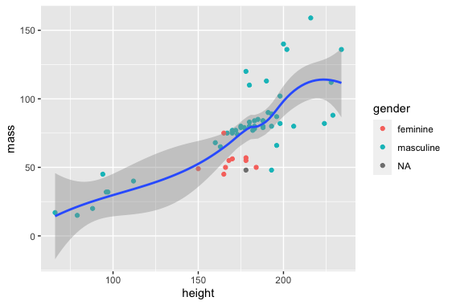

# R-Assignment 4

**Created by ณิชกานต์ ปาสาณี (ID: 63130500036)**

Choose Dataset:
1. Top 270 Computer Science / Programing Books (Data from Thomas Konstantin, [Kaggle](https://www.kaggle.com/thomaskonstantin/top-270-rated-computer-science-programing-books)) >> [Using CSV](https://raw.githubusercontent.com/safesit23/INT214-Statistics/main/datasets/prog_book.csv)

2. Superstore Sales Dataset (Data from Rohit Sahoo,[Kaggle](https://www.kaggle.com/rohitsahoo/sales-forecasting)) >> [Using CSV](https://raw.githubusercontent.com/safesit23/INT214-Statistics/main/datasets/superstore_sales.csv)


### Outlines
1. Explore the dataset
2. Learning function from Tidyverse
3. Transform data with dplyr and finding insight the data
4. Visualization with GGplot2

## Part 1: Explore the dataset

```
# Library
library(dplyr)

# Dataset
superstore <- read_csv("https://raw.githubusercontent.com/safesit23/INT214-Statistics/main/datasets/superstore_sales.csv")

# View Dataset
glimpse(superstore)
```

In this dataset has Row ID , Order ID , Order Date , Ship Date , Ship Mode , Customer ID , Customer Name , Segment , Country , City , State , Postal Code , Region , 
Product ID , Category , Sub-Category , Product Name , Sales
```
Rows: 9,800
Columns: 18
$ `Row ID`        <dbl> 1, 2, 3, 4, 5, 6, 7, 8, 9, 10, 11, 12, 13, 14, 15, 16, 17, 18, 19, 20, 21, 22, 23, 24, 25, 26, 27, 28, 2~
$ `Order ID`      <chr> "CA-2017-152156", "CA-2017-152156", "CA-2017-138688", "US-2016-108966", "US-2016-108966", "CA-2015-11581~
$ `Order Date`    <chr> "08/11/2017", "08/11/2017", "12/06/2017", "11/10/2016", "11/10/2016", "09/06/2015", "09/06/2015", "09/06~
$ `Ship Date`     <chr> "11/11/2017", "11/11/2017", "16/06/2017", "18/10/2016", "18/10/2016", "14/06/2015", "14/06/2015", "14/06~
$ `Ship Mode`     <chr> "Second Class", "Second Class", "Second Class", "Standard Class", "Standard Class", "Standard Class", "S~
$ `Customer ID`   <chr> "CG-12520", "CG-12520", "DV-13045", "SO-20335", "SO-20335", "BH-11710", "BH-11710", "BH-11710", "BH-1171~
$ `Customer Name` <chr> "Claire Gute", "Claire Gute", "Darrin Van Huff", "Sean O'Donnell", "Sean O'Donnell", "Brosina Hoffman", ~
$ Segment         <chr> "Consumer", "Consumer", "Corporate", "Consumer", "Consumer", "Consumer", "Consumer", "Consumer", "Consum~
$ Country         <chr> "United States", "United States", "United States", "United States", "United States", "United States", "U~
$ City            <chr> "Henderson", "Henderson", "Los Angeles", "Fort Lauderdale", "Fort Lauderdale", "Los Angeles", "Los Angel~
$ State           <chr> "Kentucky", "Kentucky", "California", "Florida", "Florida", "California", "California", "California", "C~
$ `Postal Code`   <dbl> 42420, 42420, 90036, 33311, 33311, 90032, 90032, 90032, 90032, 90032, 90032, 90032, 28027, 98103, 76106,~
$ Region          <chr> "South", "South", "West", "South", "South", "West", "West", "West", "West", "West", "West", "West", "Sou~
$ `Product ID`    <chr> "FUR-BO-10001798", "FUR-CH-10000454", "OFF-LA-10000240", "FUR-TA-10000577", "OFF-ST-10000760", "FUR-FU-1~
$ Category        <chr> "Furniture", "Furniture", "Office Supplies", "Furniture", "Office Supplies", "Furniture", "Office Suppli~
$ `Sub-Category`  <chr> "Bookcases", "Chairs", "Labels", "Tables", "Storage", "Furnishings", "Art", "Phones", "Binders", "Applia~
$ `Product Name`  <chr> "Bush Somerset Collection Bookcase", "Hon Deluxe Fabric Upholstered Stacking Chairs, Rounded Back", "Sel~
$ Sales           <dbl> 261.9600, 731.9400, 14.6200, 957.5775, 22.3680, 48.8600, 7.2800, 907.1520, 18.5040, 114.9000, 1706.1840,~
```

## Part 2: Learning function from Tidyverse

- Function `select()` from package [dplyr](https://dplyr.tidyverse.org/articles/dplyr.html#select-columns-with-select)). It using for select columns

```
dataset %>% select(Country , City)
```
** You can sepearate this part or combine in part of `Transform data with dplyr and finding insight the data`

## Part 3: Transform data with dplyr and finding insight the data

### 1. นับจำนวนการแบ่งส่วนงานว่ามีจำนวนเท่าไหร่ โดยนับเฉพาะสายงานที่เป็น "Consumer(ผู้บริโภค)"
```
superstore %>% count(Segment) %>% filter(Segment == "Consumer") %>% rename(total = n)
```
Result:
```
  Segment   total
1 Consumer  5101
```
#### Explain
- จะหาจำนวนของ Consumer ว่ามีเท่าไหร่
- เลือกตาราง superstore เลือกหัวข้อ Segment
- โดยจะเลือกนับเฉพาะ Segment เป็น Consumer 

### 2. แสดงข้อมูลของชื่อลูกค้าและสินค้าที่ซื้อ โดยให้เลือกหมวดหมู่สินค้าที่เป็น Technology เท่านั้นและรายชื่อลูกค้าต้องห้ามซ้ำกัน 
```
superstore %>% select (`Customer Name`, Category) %>% group_by(`Customer Name`,Category) %>% filter(`Category` == "Technology") %>% distinct(`Customer Name`)
```
Result:
```
   `Customer Name`    Category  
   <chr>              <chr>     
 1 Brosina Hoffman    Technology
 2 Zuschuss Donatelli Technology
 3 Eric Hoffmann      Technology
 4 Gene Hale          Technology
 5 Steve Nguyen       Technology
 6 Linda Cazamias     Technology
 7 Odella Nelson      Technology
 8 Lena Hernandez     Technology
 9 Janet Molinari     Technology
10 Ted Butterfield    Technology
# ... with 674 more rows
```
#### Explain
- จะหาข้อมูลของ Customer Name และ Category
- มีเงื่อนไขคือ Customer Name ชื่อห้ามซ้ำกัน และ Category อยู่ในหมวดหมู่ที่เป็น Technology เท่านั้น
- โดยจะต้องใช้ filter(`Category` == "Technology") เพื่อกำหนดให้ว่า ค่าของ Category จะต้องมีค่าเป็น Technology เท่านั้น
- และใช้ distinct(`Customer Name`) เพื่อบอกว่า ชื่อลุกค่าที่ได้มานั้น ห้ามมีชื่อที่ซ้ำกัน

### 3.หาผลรวมของยอดขายของแต่ละภาค ว่ามีเท่าไหร่
```
superstore %>% group_by(Region) %>% summarise(Sales = sum(Sales)) 
```
Result:
```
  Region   Sales
  <chr>     <dbl>
1 Central 492647.
2 East    669519.
3 South   389151.
4 West    710220.
```
#### Explain
- จะหาผลรวมของการขาย ในแต่ละภาค
- โดยเราจะ group_by ข้อมูลที่เป็น Region เพื่อจัดกลุ่มของข้อมูล
- และใช้คำสั่ง summarise() เพื่อทำการเก็บค่าของ sum(Sales) ให้เป็นค่าเดียวคือ Sales ของแต่ละ Region  

## Part 4: Visualization with GGplot2
### 1.) Graph show relation between height and mass
```
scat_plot <- starwars %>% filter(mass<500) %>% ggplot(aes(x=height,y=mass))+
  geom_point(aes(color=gender))

scat_plot+geom_smooth()
```
Result:



**Guideline:
Embed Image by using this syntax in markdown file
````

````
